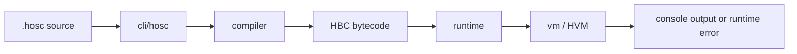
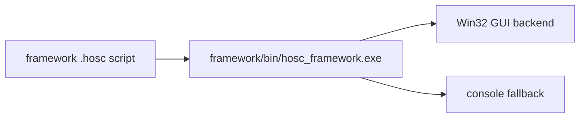
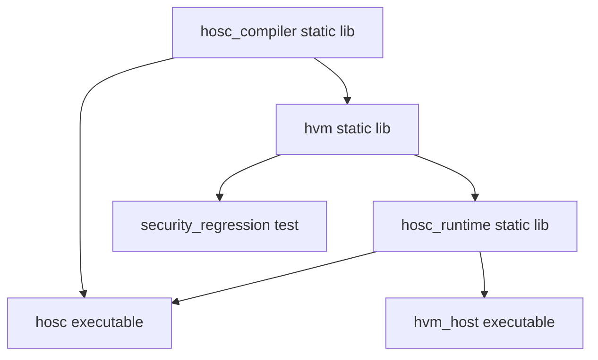
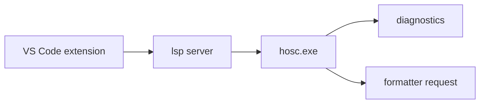

# Architecture

HOSC is split into native modules with a separate framework and editor tooling
layer.

## High-Level Workflow

Framework scripts follow a different path:

## Module Responsibilities

| Module | Responsibility |
| --- | --- |
| `compiler/` | Diagnostics, arena allocation, lexer, parser, AST, semantic placeholders, IR placeholders, bytecode emitter, import resolver, compile pipeline. |
| `vm/` | HBC loader, VM stack, call frames, dispatch loop, object/value model, native registry, GC scaffolding. |
| `runtime/` | Bytecode file execution, runtime options, embedding API, platform-specific host code, executable stub. |
| `cli/` | User-facing `hosc` command parser and command implementations. |
| `framework/` | Standalone GUI/event runtime for demos and media examples. |
| `lsp/` | TypeScript language server that shells out to `hosc.exe` for diagnostics and formatting. |
| `vscode-extension/` | VS Code client, commands, status bar, debug helper, grammar, configuration. |
| `tools/` | Bootstrap build, quality gate, helper IDE scripts, legacy tools. |
| `tests/` | CTest targets and native regression tests. |

## Native Dependency Graph

Notes:

- Top-level CMake adds `compiler`, `vm`, `runtime`, and `cli`.
- `hosc_runtime` links against `hvm`.
- `hosc` links against `hosc_compiler` and `hosc_runtime`.
- `hvm` includes `compiler/include` because the bytecode type is defined there.
- On Windows, `hvm` links `winmm`.

## Compile and Run Flow

1. `hosc run <file.hosc>` parses CLI arguments.
2. `hosc_compile_file` resolves imports and reads source.
3. `hosc_compile_memory` validates the entry point and rejects framework markers.
4. `parser_parse` builds an AST.
5. The bytecode emitter collects functions and emits HBC code.
6. `hosc_runtime_run_bytecode` creates/configures an HVM.
7. `hvm_execute` loads bytecode and runs the entry function.
8. Native calls, including `print`, are resolved through the VM native registry.

## Import Resolution

The compiler pipeline currently resolves imports before parsing:

- `import "relative/path.hosc"` is treated as a quoted file path.
- `import some.module` is converted to `some\module.hosc`.
- Imports are resolved relative to the importing file directory.
- Repeated imports are skipped after loading.
- Recursive active imports fail resolution.
- Imported package lines are omitted for non-entry files.

## Framework Boundary

The framework is intentionally documented as a separate runtime. The compiler
pipeline checks for GUI markers such as `window(`, `text(`, `loop(`,
`pump_events(`, `on_click(`, `on_key(`, `on_mouse_move(`, and
`win32_message_box(`. When these markers are found, the compiler reports that
the script should be run with `framework/bin/hosc_framework.exe`.

## Editor Workflow

Current caveat: formatting depends on `hosc fmt`, which is a bootstrap stub.
Diagnostics depend on parsing CLI diagnostic output.

## Generated and Local Artifacts

Common generated paths:

- `build/bootstrap/`
- `build/cmake/`
- `build/codex-security/`
- `tools/bin/`
- `framework/bin/`
- `framework/build/`
- `lsp/out/`
- `vscode-extension/out/`
- `*.hbc` beside source files

Keep generated binaries and bytecode out of release docs unless the release
intentionally packages them.
